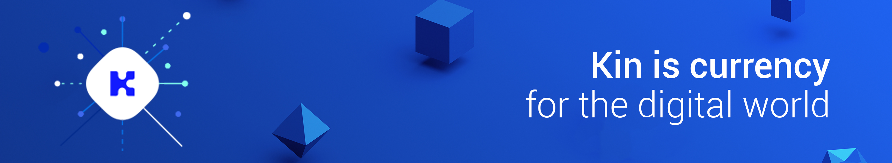

# Kin SDK for Unity

Kin SDK for Unity is responsible for providing access to the Kin native SDKs for managing Kin balance and transactions.


## Android Setup

The Kin plugin uses the Gradle build system on Android. See the [Building with Gradle for Android](https://docs.unity3d.com/Manual/android-gradle-overview.html) section of Unity's documentation and the [Providing a custom build.gradle template](https://docs.unity3d.com/Manual/android-gradle-overview.html) to enable the use of a custom gradle file.

Open the `Plugins/Android/mainTemplate.gradle` file and add the following:
```gradle
...

allprojects {
    repositories {
        ...
		jcenter()
		google()
		maven { url 'https://jitpack.io' }
    }
}

...

dependencies {

    ...
        implementation 'com.github.kinecosystem.kin-sdk-android:kin-sdk-lib:1.0.5'
        implementation 'com.github.kinecosystem.kin-sdk-android:kin-backup-and-restore-lib:1.0.5'

**DEPS**}

...

android {
    compileOptions {
        sourceCompatibility 1.8
        targetCompatibility 1.8
    }

    ...
}
```


## iOS Setup - Not supported yet

In the iOS Player Settings, the `Target minimum iOS Version` must be set to 8.1 or newer.

Note: if you plan on doing any native iOS developement on the plugin, there are some changes that need to be made to the KinSDK, KinUtil and Sodium Xcode projects. They all need to have bitcode enabled and "build active achitectures only" set to no so that you can get debug symobols.


## Get Started

### Connecting to a service provider

Create a new `KinClient`, with an `Environment` enum that provides details of how to access the kin blockchain end point, Environment provides the predefined `Environment.TEST` and `Environment.PRODUCTION`.

`appId` is a 4 character string which represent the application id which will be added to each transaction.
appId must contain only upper and/or lower case letters and/or digits and that the total string length is exactly 4.

An optional parameter is `storeKey` which can be used to create a multiple accounts data set,
each different `storeKey` will have a separate data, an example use-case - store multiple users accounts separately.


The example below creates a `KinClient` that will be used to connect to the kin test network:

```csharp
kinClient = new KinClient( Environment.TEST, "1acd" )
```

### Creating and retrieving a KIN account

The first time you use `KinClient` you need to create a new account, the details of the created account will be securely stored on the device. Multiple accounts can be created using `AddAccount`.

```csharp
KinAccount account;
try
{
    if( !kinClient.HasAccount() )
        account = kinClient.AddAccount();
}
catch( Exception e )
{
    Debug.LogError( e );
}
```

Calling `GetAccount` with the existing account index, will retrieve the account stored on the device.

```csharp
if( kinClient.HasAccount() )
    account = kinClient.GetAccount( 0 );
```

You can delete your account from the device using `DeleteAccount`, but beware! you will lose all your existing KIN if you do this.

```csharp
kinClient.DeleteAccount( int index );
```

## Onboarding

Before an account can be used on the configured network, it must be created on the blockchain and funded with the native network asset. This step must be performed by a service, see the [Kin SDK documentation](https://github.com/kinecosystem/kin-sdk-android/blob/master/README.md) for details. When working with the Kin test servers, you can use the friendbot service (see the `KinOnboarding` class in the Unity demo project) to get your test accounts setup and funded.


## Account Information

### Public Address

Your account can be identified via its public address. To retrieve the account public address use:

```csharp
account.GetPublicAddress();
```

### Query Account Status

Current account status on the blockchain can be queried using `GetStatus` method, status will be one of the following 2 options:

* `AccountStatus.NotCreated` - Account is not created (funded with native asset) on the network. The account cannot send or receive KIN yet.
* `AccountStatus.Created` - Account was created, account can send and receive KIN.

```csharp
account.GetStatus( ( ex, status ) =>
{
	if( ex == null )
		Debug.Log( "Account status: " + status );
	else
		Debug.LogError( "Get Account Status Failed. " + ex );
});
```

### Retrieving Balance

To retrieve the balance of your account in KIN call the `GetBalance` method: 

```csharp
account.GetBalance( ( ex, balance ) =>
{
	if( ex == null )
		Debug.Log( "Balance: " + balance );
	else
		Debug.LogError( "Get Balance Failed. " + ex );
});
```

## Transactions

### Transferring Kin to another account

To transfer Kin to another account, you need the public address of the account you want to transfer the KIN to. Also if your app is not in the Kin whitelist then you need to also apply a fee. Amount of 1 fee equals to 1/100000 KIN. If you are in the whitelist then look after the next example to see how you can send a whitelist transaction.

The following code will transfer 20 Kin to the recipient account "GDIRGGTBE3H4CUIHNIFZGUECGFQ5MBGIZTPWGUHPIEVOOHFHSCAGMEHO".

```csharp
var toAddress = "GDIRGGTBE3H4CUIHNIFZGUECGFQ5MBGIZTPWGUHPIEVOOHFHSCAGMEHO";
var amountInKin = 20;
var fee = 100;

// we could use here some custom fee or we can can call the blockchain in order to retrieve
// the current minimum fee by calling kinClient.getMinimumFee(). Then when you get the minimum
// fee returned and you can start the 'send transaction flow' with this fee.
account.BuildTransaction( toAddress, amountInKin, fee, ( ex, transaction ) =>
{
	if( ex == null )
	{
        // Here we already got a Transaction object before actually sending the transaction. This means
        // that we can, for example, send the transaction id to our servers or save it locally  
        // in order to use it later. For example if we lose network just after sending 
        // the transaction then we will not know what happened with this transaction. 
        // So when the network is back we can check what is the status of this transaction.
		Debug.Log( "Build Transaction result: " + transaction );
		account.SendTransaction( transaction, ( ex, transactionId ) =>
		{
			if( ex == null )
				Debug.Log( "Send Transaction result: " + transactionId );
			else
				Debug.LogError( "Send Transaction Failed. " + ex );
		});
	}
	else
	{
		Debug.LogError( "Build Transaction Failed. " + ex );
	}
});
```


### Transferring Kin to another account using whitelist service

The flow is very similar to the above code but here there is a middle stage in which you get the whitelistable transaction details from the 'Transaction' object just after you build the transaction and you send it to the whitelist service (which is hosted on your own servers). Then you use the method 'sendWhitelistTransaction( string whitelist )' where the parameter `whitelist` for that method is what you get back from the whiteliest service.

```csharp
account.BuildTransaction( toAddress, amountInKin, fee, ( ex, transaction ) =>
{
	if( ex == null )
	{
		Debug.Log( "Build Transaction result: " + transaction );

		var whitelistTransaction = YourWhitelistService.WhitelistTransaction( transaction );
		account.SendWhitelistTransaction( transaction.Id, whitelistTransaction, ( ex, transactionId ) =>
		{
			if( ex == null )
				Debug.Log( "Send Transaction result: " + transactionId );
			else
				Debug.LogError( "Send Transaction Failed. " + ex );
		});
	}
	else
	{
		Debug.LogError( "Build Transaction Failed. " + ex );
	}
});
```


#### Memo

Arbitrary data can be added to a transfer operation using the memo parameter, the memo can contain a utf-8 string up to 21 bytes in length. A typical usage is to include an order number that a service can use to verify payment.

```csharp
var memo = "arbitrary data";

account.BuildTransaction( toAddress, amountInKin, fee, memo, ( ex, transaction ) =>
{
	if( ex == null )
	{
        // Here we already got a Transaction object before actually sending the transaction. This means
        // that we can, for example, send the transaction id to our servers or save it locally  
        // in order to use it later. For example if we lose network just after sending 
        // the transaction then we will not know what happened with this transaction. 
        // So when the network is back we can check what is the status of this transaction.
		Debug.Log( "Build Transaction result: " + transaction );
		account.SendTransaction( transaction, ( ex, transactionId ) =>
		{
			if( ex == null )
				Debug.Log( "Send Transaction result: " + transactionId );
			else
				Debug.LogError( "Send Transaction Failed. " + ex );
		});
	}
	else
	{
		Debug.LogError( "Build Transaction Failed. " + ex );
	}
});
```
account.SendTransaction( toAddress, amountInKin, memo, ( ex, transactionId ) =>
{
	if( ex == null )
		Debug.Log( "Send Transaction: " + transactionId );
	else
		Debug.LogError( "Send Transaction Failed. " + ex );
});
```

## Account Listeners

### Listening to payments

Ongoing payments in Kin, from or to an account, can be observed, by adding payment listener:

```csharp
account.AddPaymentListener( this );

...

public void OnEvent( PaymentInfo payment )
{
	Debug.Log( "On Payment: " + payment );
}
```

### Listening to balance changes

Account balance changes, can be observed by adding balance listener:

```csharp
account.AddBalanceListener( this );

...

public void OnEvent( decimal balance )
{
	Debug.Log( "On Balance: " + balance );
}
```

### Listening to account creation

Account creation on the blockchain network, can be observed, by adding create account listener:

```csharp
account.AddAccountCreationListener( this );

...

public void OnEvent()
{
	Debug.Log( "On Account Created" );
}
```

To unregister any listener use `RemovePaymentListener`, `RemoveBalanceListener` or `RemoveAccountCreationListener` methods.

## Account Backup & Restore
The SDK comes with a built-in module that provides an easy way to back up and restore an account.
The module's UI includes two flows, Backup and Restore. The UI wraps the native SDK's import and export
functionalities, on which these flows are based.
The UI uses a password to create a QR code, which is then used to back up the account and to restore it.

### Backup

To back up an account, all you need to do is call the ```BackupAccount``` method of the ```KinAccount``` you wish to back up.
The method requires two parameters - the ```KinClient``` object and an OnComplete callback.
```csharp
account.BackupAccount(_client,
               (KinException ex, BackupRestoreResult result) => {
                   switch (result)
                   {
                       case BackupRestoreResult.Success:
                           Debug.Log("Account backed up successfully");
                           break;
                       case BackupRestoreResult.Cancel:
                           Debug.Log("Account backup canceled");
                           break;
                       case BackupRestoreResult.Failed:
                           Debug.Log("Account backup failed");
                           Debug.LogError(ex);
                           break;
```

### Restore

To restore a Kin account, you need to call the ```RestoreAccount``` method of the ```KinClient``` object.
The method only requires an OnComplete callback.

```csharp
client.RestoreAccount(
               (KinException ex, BackupRestoreResult result, KinAccount account) => {
                   switch (result)
                   {
                       case BackupRestoreResult.Success:
                           Debug.Log("Account successfully restored");
                           // Save the restored account
                           MyAccount = account;
                           break;
                       case BackupRestoreResult.Cancel:
                           Debug.Log("Account restoration canceled");
                           break;
                       case BackupRestoreResult.Failed:
                           Debug.Log("Account restoration failed");
                           Debug.LogError(ex);
                           break;
                   }
```

Please note that the SDK launches a separate native activity to perform the backup/restore process.

### Import & Export
If you wish to import and export an account without the UI that the previous methods provided, you can use the following:

To export:  
You can export an account using its corresponding `KinAccount` object. It will return the account data as a JSON string.  
You just need to pass a passphrase, which will be used to encrypt the the private key.  
This passphrase will be later needed to import the account.  

```csharp
exportedAccountJson = account.Export( importExportPassphrase );
```


To import:  
You need to pass the JSON string that was received when the account was exported and the passphrase that was used to export the account.

```csharp
account = client.ImportAccount( exportedAccountJson, importExportPassphrase );
```


## Error Handling

The Kin Unity Plugin wraps Kin native exceptions in the C# KinException class. It provides a `NativeType` field that will contain the native error type, some of which are in the Common Error section that follows.


### Common Errors

`AccountNotFoundException` - Account is not created (funded with native asset) on the network.  
`AccountNotActivatedException` - Account was created but not activated yet, the account cannot send or receive KIN yet.  
`InsufficientKinException` - Account has not enough kin funds to perform the transaction.


## Demo Scene

The demo scene included with the Kin Unity Plugin covers the functionality of the plugin, and serves as a detailed example on how to use the it.


## Contributing
Please review our [CONTRIBUTING.md](CONTRIBUTING.md) guide before opening issues and pull requests.


## License
The kin-unity-plugin is licensed under [Kin Ecosystem SDK License](LICENSE.pdf).
